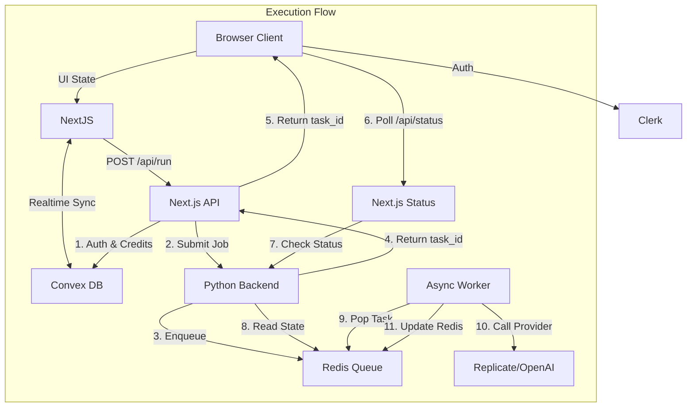

# Technical Documentation & Architecture

## 1. System Overview
**Karate AI – Design Studio** is a unified AI workspace combining a professional visual node editor (XYFlow/React Flow) with a robust backend orchestration layer.

**Core Value Proposition:**
- **Visual Workflow Builder:** Drag-and-drop interface to chain AI models (Image, Video, Audio, 3D).
- **Multi-Provider Integration:** Unified access to Stability AI, Black Forest Labs (Flux), OpenAI, Google (Imagen/Veo), Runway, and more via a single API.
- **Real-time Collaboration:** Google Docs-style multiplayer editing powered by Convex.
- **Enterprise Billing:** Server-side credit system with atomic transactions.

---

## 2. Tech Stack

| Layer | Technology | Role |
|-------|------------|------|
| **Frontend** | Next.js 16 (React 19) | App Router & Pages Router hybrid. Host application. |
| **Editor Engine** | XYFlow (React Flow) | Canvas rendering, node logic, edge connections. |
| **State & Sync** | Convex | Real-time database, serverless functions, WebSocket sync. |
| **Identity** | Clerk | User authentication, session management, JWT issuance. |
| **Backend API** | Python FastAPI | AI orchestration, proxying to 3rd party APIs. |
| **Task Queue** | Redis | Persistent job queue for async long-running tasks. |
| **Payments** | Stripe | Credit purchasing, webhooks, checkout flows. |

---

## 3. Architecture

### 3.1 High-Level Data Flow


### 3.2 Key Subsystems

#### Authentication & User Sync
1.  **Login**: User logs in via Clerk.
2.  **Token Sync**: A `UserSync` component on the frontend ensures the user exists in Convex.
3.  **Identity**: We store a `tokenIdentifier` (Clerk Subject ID) in Convex to securely link the two systems.
4.  **Security**: Convex functions use `ctx.auth.getUserIdentity()` to verify the caller.

#### Credit System (Server-Authoritative)
-   **Balance**: Stored in `users` table in Convex.
-   **Deduction**: Happens *atomically* inside a Convex Mutation (`runs:create`) *before* the AI job is submitted.
-   **Refunds**: (Planned) If a job fails, a refund mutation restores credits.
-   **Purchase**: Stripe Webhook -> Convex Mutation -> Update Balance + Log Transaction.

#### AI Orchestration
-   **Gateway**: The Python backend (`backend/`) acts as the single gateway to all AI providers.
-   **Standardization**: It normalizes inputs (prompt, negative_prompt, aspect_ratio) and outputs (image URL) across different providers.
-   **Persistence**: Job status is stored in **Redis**, ensuring reliability even if the API server restarts.

---

## 4. Project Structure

### Frontend (`frontend/`)
-   `components/NodeEditor/`: The core canvas logic.
    -   `Canvas.tsx`: Main editor component. Handles polling, node updates, and running.
    -   `NodeTypes/`: Custom node definitions (StableDiffusion, Image, Text, etc.).
-   `pages/api/run.ts`: The entry point for running models. Bridges Auth (Clerk), DB (Convex), and Compute (FastAPI).
-   `lib/models.ts`: Central registry of available models, tools, and their metadata (logos, categories).

### Backend (`backend/`)
-   `main.py`: FastAPI entry point.
-   `api/v1/ai.py`: Endpoints for inference (`/infer`) and status (`/status/{task_id}`).
-   `workers/tasks.py`: Core logic for processing jobs. Connects to Redis and calls external APIs (Replicate, etc.).
-   `core/config.py`: Configuration for model costs and API keys.

### Database (`convex/`)
-   `schema.ts`: Database schema definitions.
-   `users.ts`: User management logic.
-   `runs.ts`: Run creation and logging.
-   `workflows.ts`: Workflow CRUD.

### Scripts (`scripts/`)
-   `grant_credits.ts`: Admin tool to manually add credits to a user.
-   `list_users.ts`: Debug tool to view registered users.
-   `run_reset.ts`: Nuclear option to wipe the database (dev only).

---

## 5. Admin & Maintenance

### Granting Credits (Testing)
Since we use a real billing system, you might need credits for testing without paying.
```bash
# Syntax: npx tsx scripts/grant_credits.ts <user_email> <amount>
npx tsx scripts/grant_credits.ts user@example.com 1000
```

### Managing Models
To add a new model:
1.  **Frontend**: Add it to `MODELS` in `frontend/lib/models.ts`.
2.  **Frontend**: Add a mapping in `Canvas.tsx` (`handleRun` function) to convert the UI label to an internal ID.
3.  **Backend**: Update `backend/workers/tasks.py` to map the internal ID to the provider's slug (e.g., Replicate ID).
4.  **Backend**: Restart the backend server.

### Environment Variables
| Service | Variable | Purpose |
|---------|----------|---------|
| **Backend** | `INTERNAL_API_KEY` | Secures communication from Frontend. Must match Frontend's value. |
| **Backend** | `REDIS_URL` | Connection string for Redis task queue. |
| **Frontend** | `NEXT_PUBLIC_CONVEX_URL` | URL of the Convex cloud instance. |
| **Frontend** | `NEXT_PUBLIC_CLERK...` | Clerk Auth key. |
