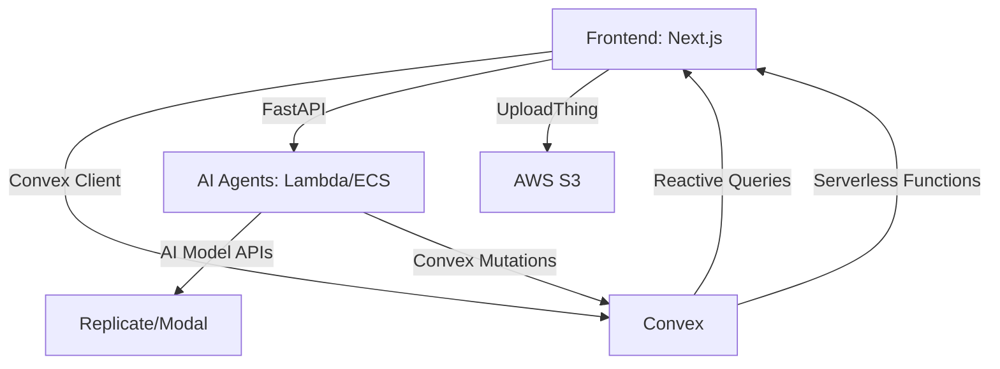
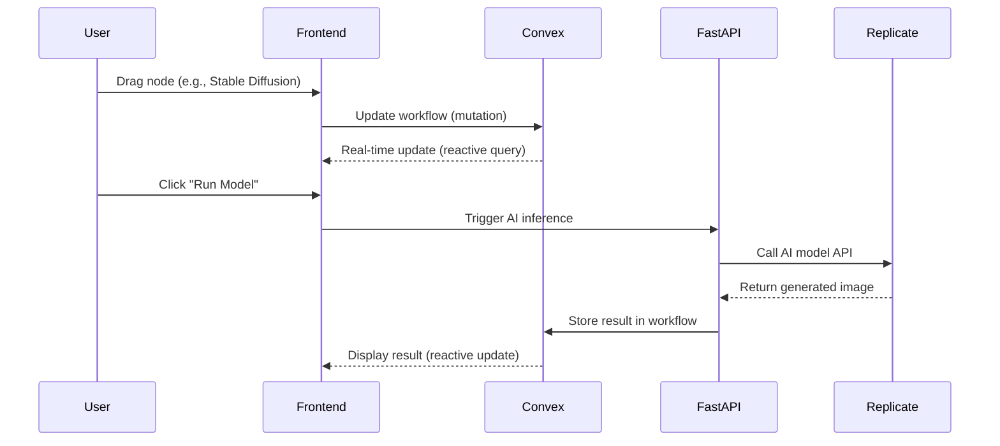
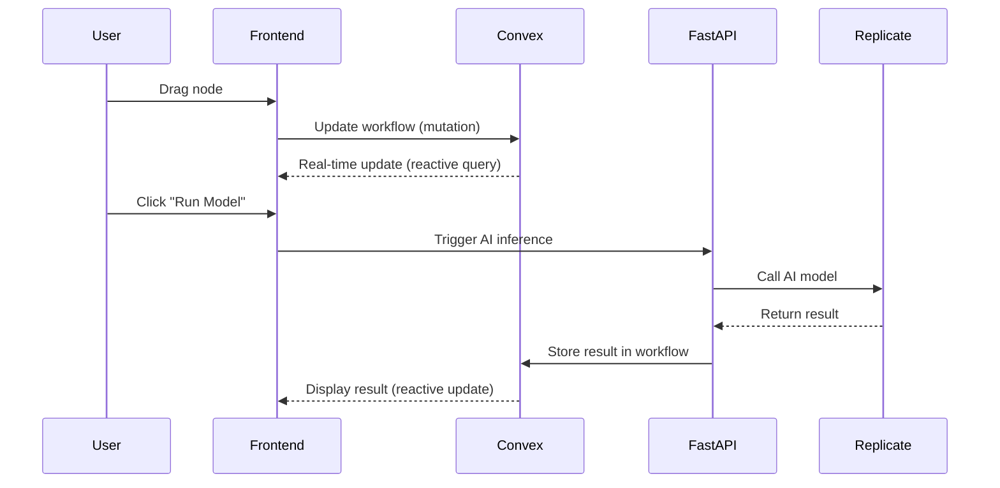

# Technical Documentation

## Guide Index
1. [System Overview](#1-system-overview)
2. [Tech Stack](#2-tech-stack)
3. [Architecture](#3-architecture)
4. [Frontend](#4-frontend)
5. [Backend](#5-backend)
6. [AI Models & Tools](#6-ai-models--tools)
7. [Convex Integration](#7-convex-integration)
8. [AI Agents](#8-ai-agents)
9. [Deployment](#9-deployment)
10. [Security & Compliance](#10-security--compliance)
11. [Monitoring & Logging](#11-monitoring--logging)
12. [Data Flow & APIs](#12-data-flow--apis)
13. [Error Handling](#13-error-handling)
14. [CI/CD Pipeline](#14-cicd-pipeline)
15. [Roadmap](#15-roadmap)
16. [Getting Started](#17-getting-started)

---

# 1. System Overview
**Karate AI – Design Studio** is a **node-based AI workspace** that unifies **all AI models, editing tools, and workflows** into a single, collaborative platform. It is designed for **creative professionals, developers, and enterprises** who need **scalable, reusable, and automated** creative workflows.

- **All AI Models**: Image, video, 3D, and text models (see [full list](#6-ai-models--tools)).
- **Professional Editing Tools**: Blur, invert, mask, relight, upscale, and more.
- **Natural‑Language Builder**: Bottom AI input dock converts instructions into nodes and connections.
- **Unified Context Menu**: Right‑click anywhere on a node (not just handles) for Duplicate/Delete/Settings.
- **Real-Time Collaboration**: Multi-user editing with **Convex**.
- **Internal AI Agents**: For support, workflow optimization, resource allocation, and fraud detection.
- **Advanced Frontend**: Interactive animations, motion effects, and refined minimal UI/UX.

---

# 2. Tech Stack
## **2.1 Frontend**
| **Component**          | **Technology**               | **Purpose**                                                                 | **Alternatives**               |
|------------------------|-----------------------------|-----------------------------------------------------------------------------|--------------------------------|
| Framework              | Next.js 15 (React 18)       | Fast, SEO-friendly, and scalable UI.                                      | Remix, SvelteKit              |
| Node Editor            | XYFlow                      | High-performance, customizable node editor.                              | Rete.js, React Flow           |
| Styling               | Tailwind CSS + MUI + HeroUI | Rapid UI development with accessible components.                        | Chakra UI, Radix UI           |
| State Management      | Zustand + Jotai             | Lightweight global/local state for complex workflows.                     | Redux, Recoil                 |
| Real-Time Collaboration| Convex                     | Real-time database and serverless functions.                             | Firebase, PartyKit           |
| Media Rendering       | WebGPU (WebGL fallback)     | High-performance rendering for previews and effects.                     | Three.js, PixiJS             |
| File Upload           | UploadThing + AWS S3        | Secure, resumable uploads.                                                | Cloudinary, Backblaze        |
| Animations           | Framer Motion               | Advanced animations and motion effects.                                  | GSAP, React Spring           |
| Interactive Layouts  | React Three Fiber           | 3D interactive elements.                                                  | Babylon.js                   |

## **2.2 Backend**
| **Component**          | **Technology**               | **Purpose**                                                                 | **Alternatives**               |
|------------------------|-----------------------------|-----------------------------------------------------------------------------|--------------------------------|
| API Framework          | FastAPI (Python)            | High-performance REST/WebSocket API.                                       | NestJS, Django                |
| Real-Time Database     | Convex                     | Real-time database and serverless functions.                             | Firebase, PostgreSQL + Y.js   |
| Storage               | AWS S3 + Cloudflare CDN    | Asset storage and global CDN.                                             | Backblaze, Google Cloud      |
| Auth                  | Clerk                       | Social logins, SSO, secure sessions.                                       | NextAuth.js, Auth0, Supabase |
| Billing               | Stripe + Lemon Squeezy      | Subscriptions and payments.                                                | Paddle, PayPal                |
| Compute               | AWS ECS + Modal Labs        | Auto-scaling for AI inference.                                             | Kubernetes, Fly.io          |
| Queueing              | BullMQ (Redis)              | Job queue for AI tasks.                                                    | RabbitMQ, Celery             |
| Monitoring            | Sentry + Prometheus        | Error tracking and metrics.                                                | Datadog, New Relic           |

## **2.3 AI & Agents**
| **Component**          | **Technology**               | **Purpose**                                                                 | **Alternatives**               |
|------------------------|-----------------------------|-----------------------------------------------------------------------------|--------------------------------|
| Agent Framework        | LangChain/AutoGen           | Orchestrate internal AI agents.                                            | CrewAI, Microsoft AutoGen     |
| Reasoning Engine      | GPT-4/Claude 3              | Powers agent decision-making.                                              | Mistral, Llama 3              |
| Memory/Context        | ChromaDB/Weaviate          | Stores agent context and knowledge.                                        | Pinecone, Qdrant              |
| Model Hosting         | Replicate + Modal Labs     | Deploy and scale AI models.                                                 | Baseten, Corcel               |
| Local AI              | Ollama                     | Self-hosted models for privacy.                                             | LM Studio, Jan.ai             |

---

# 3. Architecture
## **3.1 High-Level Architecture**


## **3.2 Data Flow**


---

# 4. Frontend
## **4.1 Node Editor (XYFlow + Convex)**
### **Key Features**
- Drag-and-drop nodes for AI models and editing tools.
- Real-time collaboration with **Convex**.
- Zoom/pan, undo/redo, and keyboard shortcuts.
- Right‑click anywhere on a node to open actions (Duplicate, Delete, Settings).
- AI input dock (bottom) to build workflows with natural language; collapsible/hidden; safe‑area aware.

### **Code Structure**
```bash
frontend/
├── components/
│   ├── NodeEditor/
│   │   ├── NodeTypes/          # index.tsx registering custom nodes
│   │   ├── Canvas.tsx          # Main XYFlow canvas
│   │   └── Sidebar.tsx         # Model/tool sidebar
│   ├── Realtime/
│   │   └── Collaboration.tsx   # Convex hook (mock fallback if Convex dev not running)
│   └── Media/
│       └── (reserved)
├── lib/
│   └── convex/
│       └── client.tsx          # Convex provider (uses NEXT_PUBLIC_CONVEX_URL)
└── pages/
    ├── editor.tsx              # Main editor page
    ├── dashboard.tsx
    ├── docs.tsx
    └── index.tsx
```

### **Example: Custom Node (Stable Diffusion)**
```jsx
// components/NodeEditor/NodeTypes/StableDiffusionNode.jsx
import { useNode } from '@xyflow/react';

export default function StableDiffusionNode({ id }) {
  const { data } = useNode();
  return (
    <div className="node stable-diffusion">
      <div className="header">
        
        <span>Stable Diffusion 3.5</span>
      </div>
      <div className="body">
        <textarea
          placeholder="Prompt..."
          value={data.prompt}
          onChange={(e) => updateNode(id, { prompt: e.target.value })}
        />
        <button onClick={() => runModel(id)}>Run Model</button>
      </div>
    </div>
  );
}
```

### **TypeScript Frontend Types**
- Shared editor types live in `frontend/components/NodeEditor/types.ts`:
  - `PaletteItem`, `ContextMenuState`, and per-node data types (PromptData, ImageUploadData, etc.).
- Replace any remaining `any` in Node components with explicit data types.
- Use XYFlow’s `Node`/`Edge` generics where applicable for stricter typing.

### **Convex Integration**
```jsx
// components/Realtime/Collaboration.jsx
import { useQuery, useMutation } from "convex/react";
import { api } from "../../../convex/_generated/api";

export function useWorkflow(roomId) {
  const workflow = useQuery(api.workflows.get, { id: roomId });
  const updateWorkflow = useMutation(api.workflows.update);
  return { workflow, updateWorkflow };
}
```

### **XYFlow + Convex**
```jsx
// components/NodeEditor/Canvas.jsx
import { useWorkflow } from "../Realtime/Collaboration";

export default function Canvas({ roomId }) {
  const { workflow, updateWorkflow } = useWorkflow(roomId);

  const onNodesChange = (changes) => {
    updateWorkflow({ id: roomId, nodes: changes });
  };

  return <XYFlowCanvas nodes={workflow?.nodes} onChange={onNodesChange} />;
}
```

### **Context Menu plumbing (internal)**
- Each node’s root wrapper listens for `contextmenu` and dispatches a custom event:
  - `window.dispatchEvent(new CustomEvent('karate-node-contextmenu', { detail: { x, y, nodeId } }))`
- The canvas listens and opens a node menu at the event coordinates. This ensures right‑click works anywhere in the node surface.

### **AI Input Dock (internal)**
- State: `agentOpen`, `agentHidden`, `agentInput`, `agentBusy`.
- Placement: centered at bottom, offset by `calc(env(safe-area-inset-bottom) + 16px)`.
- Parser: naive keyword matching for Prompt/Upload/Model/Tools to create a linear chain; safe default is Prompt → Stable Diffusion.
- Future: replace with server-side planner in Convex or FastAPI.

## **4.2 Theming & Global Styles**
- Theming via `next-themes` (class-based dark mode)
- Global styles in `frontend/styles/globals.css`
- UI components: MUI and HeroUI

### **Node Surface Styles (internal)**
- `node-surface`, `node-title`, `node-input`, `node-textarea`, `node-btn`, `node-btn-primary` unify visual language across nodes.
- Context menus/palette use `context-panel`, `context-search`, `context-item`.

## **4.3 Pages (Pages Router)**
- Landing: `frontend/pages/index.tsx`
- Dashboard: `frontend/pages/dashboard.tsx`
- Editor: `frontend/pages/editor.tsx`
- Docs: `frontend/pages/docs.tsx`

## **4.4 Realtime & Local Data**
- Local storage for guest workflows on `dashboard.tsx`
- Convex integration available; `Collaboration.tsx` provides a mock fallback when Convex dev server is not running

## **4.5 Dashboard Behavior**
- Minimal UI focused on quick actions.
- Create new workflow via “New Project”; navigates to `editor?id=<workflowId>`.
- Workflows are persisted in `localStorage` under `workflows`.
- You can delete individual workflows (Delete button) or Clear All from the header.
- Empty state guides the user to create the first project.

## **4.6 Authentication (Clerk)**
- Add Clerk provider at the app root; show Sign In/Out in the top bar.
- Env required: `NEXT_PUBLIC_CLERK_PUBLISHABLE_KEY`, `CLERK_SECRET_KEY`.
- Gate advanced features (team collaboration, billing dashboard) behind sign-in.
 - Middleware: protect `/editor`, `/dashboard`, `/api/run`; exclude `/api/stripe/webhook` (Stripe signature-verified).

## **4.7 Workflow Outcomes (What users can create)**

- Images: single/batch generations, variations, upscales (PNG/JPG, optionally WEBP).
- Videos: short clips from prompts or sources, reframed/enhanced outputs (MP4).
- Edited media: background removal, inpaint/outpaint, relight, color transforms.
- Vector graphics: SVG logos/illustrations, text-to-vector conversions.
- 3D assets: meshes/scenes for downstream tools (.glb/.gltf/.obj when those nodes are active).
- Auxiliary artifacts: masks, depth maps, control images, prompts/metadata.
- Reusable workflows: save graphs as templates for reproducible pipelines.

---

# 5. Backend
## **5.1 FastAPI Structure (Current)**
```bash
backend/
├── api/
│   └── v1/
│       ├── ai.py              # AI inference endpoint (stubbed)
│       └── agents.py          # Internal AI agents (stubbed)
├── core/                      # Reserved for settings/security
├── db/                        # Reserved for future DB models
├── workers/
│   └── tasks.py               # AI task stubs (to wire to providers)
└── main.py                    # FastAPI app setup
```

### **Example: AI Inference Endpoint**
```python
# backend/api/v1/ai.py
from fastapi import APIRouter, Depends
from backend.workers.tasks import run_ai_model

router = APIRouter()

@router.post("/infer")
async def infer(
    model: str,
    prompt: str,
    user: User = Depends(get_current_user)
):
    if user.credits < MODEL_COSTS[model]:
        raise HTTPException(status_code=400, detail="Insufficient credits")
    task = run_ai_model.delay(model, prompt, user.id)
    return {"task_id": task.id}
```

### **Example: AI Agent Endpoint**
```python
# backend/api/v1/agents.py
from fastapi import APIRouter
import httpx

router = APIRouter()
client = convex.ConvexClient("YOUR_CONVEX_URL")

@router.post("/support")
async def support_agent(ticket: str):
    response = handle_support_ticket(ticket)
    await client.mutation("agents:logAction", {
        "type": "support",
        "ticket": ticket,
        "response": response,
    })
    return {"response": response}
```

---

# 6. AI Models & Tools
## **6.1 Complete List of AI Models**
### **Image Models**
- Flux Pro 1.1 Ultra
- Stable Diffusion 3.5
- Ideogram V3
- DALL·E 3
- Imagen 3
- Minimax Image 01
- Bria
- Hunyuan
- Recraft V3
- GPT img 1
- Wan

### **Video Models**
- Runway Gen-4
- Luma Ray 2
- Minimax Video
- Veo 3

### **3D Models**
- Kling
- Rodin 2.0
- Trellis 3D

### **Text Models**
- GPT-4
- Claude 3

### **Specialized Models**
- Nvidia Sana
- Nvidia Consistency
- Vectorizer
- Recraft V3 SVG
- Text To Vector

## **6.2 Editing Tools**
- Default
- Blur
- Invert
- Crop
- Mask Extractor
- Inpaint
- Painter
- Relight
- Upscale
- Z-Depth Extractor
- Channels
- Outpaint
- Image Describer

## **6.3 Model Integration Code**
```python
# workers/tasks.py
from replicate.client import Replicate
from openai import OpenAI

async def run_ai_model(model: str, prompt: str, user_id: str):
    if model == "stable-diffusion-3.5":
        replicate = Replicate(api_token=os.getenv("REPLICATE_API_TOKEN"))
        output = replicate.run(
            "stability-ai/sdxl:39ed52f2a78e934b3ba6e2a89f5b1c71dcde277882d13b833d5c75deae501615",
            input={"prompt": prompt}
        )
        return output
    elif model == "dalle-3":
        openai = OpenAI(api_key=os.getenv("OPENAI_API_KEY"))
        response = openai.images.generate(
            model="dall-e-3",
            prompt=prompt,
            n=1,
            size="1024x1024"
        )
        return response.data[0].url
```

---

# 7. Convex Integration
## **7.1 Schema**
```javascript
// convex/schema.ts
import { defineSchema, defineTable } from "convex/server";
import { v } from "convex/values";

export default defineSchema({
  workflows: defineTable({
    title: v.string(),
    nodes: v.array(v.any()),
    edges: v.array(v.any()),
    owner: v.string(),
    isPublic: v.boolean(),
    createdAt: v.number(),
    updatedAt: v.number(),
  }).index('by_owner', ['owner']),

  users: defineTable({
    name: v.string(),
    email: v.string(),
    credits: v.number(),
    createdAt: v.number(),
  }).index('by_email', ['email']),

  agents: defineTable({
    type: v.string(),
    action: v.string(),
    data: v.any(),
    timestamp: v.number(),
  }).index('by_type', ['type']),

  runs: defineTable({
    workflowId: v.id('workflows'),
    userId: v.id('users'),
    status: v.string(),
    result: v.any(),
    startedAt: v.number(),
    completedAt: v.optional(v.number()),
  }).index('by_workflow', ['workflowId']),
});
```

## **7.2 Queries and Mutations (Current Status)**
```javascript
// convex/workflows.ts (temporary shims until Convex codegen)
// NOTE: Replace shimmed imports with `./_generated/server` after `npx convex dev`

export const get = query({
  args: { id: v.string() },
  handler: async (ctx, args) => {
    const workflows = await ctx.db.query('workflows').collect();
    return workflows[0] || {
      id: 'demo-room',
      title: 'My First Flow',
      nodes: [],
      edges: [],
      owner: 'demo-user',
      isPublic: true,
      createdAt: Date.now(),
      updatedAt: Date.now(),
    };
  },
});

export const update = mutation({
  args: {
    id: v.any(),
    title: v.optional(v.string()),
    nodes: v.optional(v.array(v.any())),
    edges: v.optional(v.array(v.any())),
  },
  handler: async (ctx, args) => {
    const list = await ctx.db.query('workflows').collect();
    if (list.length === 0) {
      return await ctx.db.insert('workflows', {
        title: args.title || 'My First Flow',
        nodes: args.nodes || [],
        edges: args.edges || [],
        owner: 'demo-user',
        isPublic: true,
        createdAt: Date.now(),
        updatedAt: Date.now(),
      });
    }
    const wf = list[0];
    return await ctx.db.patch(wf._id, {
      ...(args.title && { title: args.title }),
      ...(args.nodes && { nodes: args.nodes }),
      ...(args.edges && { edges: args.edges }),
      updatedAt: Date.now(),
    });
  },
});
```

## **7.3 Frontend Integration**
```javascript
// frontend/components/Realtime/Collaboration.tsx
// Uses a mock fallback when Convex dev server isn't running.
// Replace with useQuery/useMutation from 'convex/react' once `npx convex dev` generates types.
```

## **7.4 TypeScript Types & Codegen (Important)**
- Until `npx convex dev` generates `convex/_generated`, we provide shared types in `convex/types.ts` to avoid `any`.
- Replace temporary shims with real imports when codegen is available:
  - `import { query, mutation } from './_generated/server'`
  - `import { v } from 'convex/values'`
- Use strong types for all Convex functions:
  - Args object type
  - Return type (queries/mutations)
  - Table `Id<'table'>` once available

Example:
```ts
// convex/runs.ts
export const create = mutation<{ workflowId: Id<'workflows'>; userId: Id<'users'>; input?: unknown }, Id<'runs'>>({
  args: { workflowId: v.id('workflows'), userId: v.id('users'), input: v.optional(v.any()) },
  handler: async (ctx, args) => { /* ... */ },
});
```

---

# 8. AI Agents
## **8.1 Current MVP**
- Backend endpoint: `POST /api/v1/agents/support` accepts `{ ticket: string }` and can post to Slack via `SLACK_WEBHOOK_URL` if set. Returns an acknowledgement.
- Convex module: `convex/agents.ts` with `logAction` and `list` for agent event logging. Replace shims with generated imports after `npx convex dev`.

### Environment
```env
INTERNAL_API_KEY=dev-secret           # protects backend routes
SLACK_WEBHOOK_URL=https://hooks.slack.com/services/... (optional)
```

## **8.2 Planned Agents (Roadmap)**
| **Agent**               | **Trigger**               | **Action**                                    | **Output**                 |
|-------------------------|---------------------------|-----------------------------------------------|---------------------------|
| Workflow Agent          | Cron (daily)              | Analyze workflows, suggest improvements       | Issue/task suggestions    |
| Resource Agent          | Cron (10 min)             | Monitor usage, scale workloads                 | Slack alert + scaling     |
| Fraud Agent             | User action               | Detect anomalies, flag accounts                | Slack alert + dashboard   |
| Marketing Agent         | Inactivity (7 days)       | Draft email with tips                          | Email via provider        |

## **8.2 Agent Code Examples**
### **Support Agent (AWS Lambda)**
```python
# agents/support.py
import openai
import convex

def handle_support_ticket(ticket: str):
    client = convex.ConvexClient("YOUR_CONVEX_URL")
    workflows = client.query("workflows:list")

    response = openai.ChatCompletion.create(
        model="gpt-4",
        messages=[{
            "role": "user",
            "content": f"""
            Draft a support response for this ticket: {ticket}.
            Use these workflows for context: {workflows}.
            """
        }]
    )

    client.mutation("agents:logAction", {
        "type": "support",
        "ticket": ticket,
        "response": response["choices"][0]["message"]["content"],
    })

    return response
```

### **Resource Agent (AWS ECS)**
```python
# agents/resource.py
import boto3
import convex

def scale_resources():
    ecs_client = boto3.client('ecs')
    convex_client = convex.ConvexClient("YOUR_CONVEX_URL")

    clusters = ecs_client.list_clusters()['clusterArns']
    for cluster in clusters:
        services = ecs_client.list_services(cluster=cluster)['serviceArns']
        for service in services:
            metrics = ecs_client.describe_services(cluster=cluster, services=[service])
            if metrics['services'][0]['runningCount'] > 5 and metrics['services'][0]['cpu'] < 20:
                ecs_client.update_service(
                    cluster=cluster,
                    service=service,
                    desiredCount=metrics['services'][0]['runningCount'] - 1
                )
                convex_client.mutation("agents:logAction", {
                    "type": "resource",
                    "action": "scale_down",
                    "data": { "service": service, "cluster": cluster },
                })
```

## **8.3 Agent Job System (Internal Queue)**
We use a Convex-backed queue for internal agents (e.g., marketing manager, weekly digest, churn checks).

### Schema additions
```
// convex/schema.ts
agent_jobs: defineTable({
  type: v.string(),          // e.g., 'marketing.campaign'
  status: v.string(),        // queued | claimed | completed | failed
  payload: v.any(),
  createdAt: v.number(),
  claimedAt: v.optional(v.number()),
  completedAt: v.optional(v.number()),
  claimedBy: v.optional(v.id('users')),
  result: v.optional(v.any()),
  error: v.optional(v.string()),
  priority: v.optional(v.number()),
}).index('by_status', ['status']).index('by_type', ['type']).index('by_createdAt', ['createdAt'])
```

### Functions
```
// convex/agentsOps.ts
export const enqueue(type, payload, priority?)
export const claimNext({ type?, userId? })
export const complete({ id, result? })
export const fail({ id, error })
export const list({ status?, type? })
```

### Marketing helpers
```
// convex/marketing.ts
scheduleCampaign({ audience, templateId, metadata? })
scheduleChurnCheck({ lookbackDays })
scheduleWeeklyDigest({ audience })
```

### Worker pattern
- A periodic runner (cron/Edge task/Convex scheduler) calls `claimNext()` by type and processes jobs.
- On success call `complete({ id, result })`; on error `fail({ id, error })`.
- Results can be written back to `runs`, `agents`, or notify Slack.

### Access & Roles
- Only `admin` and `staff` may enqueue/claim jobs by default.
- End-user actions (like “request help”) create `tickets`; staff/agents can respond and optionally enqueue supporting jobs.

---

# 9. Deployment
## **9.1 Prerequisites**
- Node.js 18+
- npm 9+
- Vercel CLI: `npm install -g vercel`
- Convex CLI: `npm install -g convex`

## **9.2 Environment Variables**
- `NEXT_PUBLIC_CONVEX_URL`: production Convex URL used by the frontend

## **9.3 Build Locally**
```bash
cd frontend
npm install
npm run build
npm run lint
```

## **9.4 Run Locally**
```bash
# Terminal 1: Frontend
cd frontend
npm run dev

# Terminal 2: Backend (optional)
python3 -m venv backend/.venv && source backend/.venv/bin/activate
python3 -m pip install -U pip
python3 -m pip install -r backend/requirements.txt
export INTERNAL_API_KEY=dev-secret
python3 -m uvicorn backend.main:app --reload
```

## **9.5 Deploy Frontend (Vercel)**
```bash
cd frontend
vercel --prod
```
Set `NEXT_PUBLIC_CONVEX_URL` in Vercel project settings.

## **9.6 Deploy Backend (Convex)**
```bash
npx convex deploy --prod
```
Copy the production URL and set it as `NEXT_PUBLIC_CONVEX_URL`.

## **9.7 Verification**
- Visit production domain
- Test Dashboard, Editor, Docs
- Check browser console for errors

## **9.8 Troubleshooting**
- Fix build/type errors locally
- Confirm environment variables
- Hard-refresh and clear caches

## **9.9 Notes**
Convex handles scaling, real-time sync, and serverless functions automatically.

## **9.10 Terraform for AWS (optional)**
```hcl
# main.tf
provider "aws" {
  region = "us-east-1"
}

resource "aws_ecs_cluster" "karate" {
  name = "karate-cluster"
}

resource "aws_ecs_task_definition" "backend" {
  family                   = "karate-backend"
  network_mode             = "awsvpc"
  requires_compatibilities = ["FARGATE"]
  cpu                      = 2048
  memory                   = 4096
  container_definitions = jsonencode([{
    name      = "karate-backend",
    image     = "your-ecr-repo/karate-backend:latest",
    essential = true,
    portMappings = [{ containerPort = 8000, hostPort = 8000 }],
    environment = [
      { name = "CONVEX_URL", value = "https://your-convex-url.convex.cloud" },
    ],
  }])
}
```

---

# 10. Security & Compliance
## **10.1 Data Protection**
- **Encryption**: AES-256 for data at rest, TLS 1.3 for data in transit.
- **Access Control**: Row-level security in Convex.
- **Audit Logs**: Track all agent actions and admin changes.

## **10.2 Compliance**
- **GDPR**: User data deletion API, anonymized logs.
- **CCPA**: Opt-out for data collection.
- **SOC 2**: Regular audits, access controls, and monitoring.

---

# 10.3 Security Hardening (Production)
- CORS: restrict to known domains only (no wildcards).
- API Secrets: server-side only; never expose paid keys to the frontend.
- Rate limiting: add limiter to sensitive endpoints (AI/agents).
- Input allow-list: validate `model` against `MODEL_COSTS`.
- Storage: use presigned URLs; avoid public buckets for private assets.
- Logging: scrub secrets; enable Sentry.
- Convex access: validate userId and ownership in mutations/queries.

# 11. Monitoring & Logging
## **11.1 Tools**
| **Tool**          | **Purpose**                                      |
|-------------------|--------------------------------------------------|
| Prometheus        | Metrics collection (CPU, memory, latency).       |
| Grafana           | Dashboards for metrics.                           |
| Sentry            | Error tracking and alerts.                       |
| AWS CloudWatch    | Logs and cloud resource monitoring.            |

## **11.2 Logging Structure**
```json
{
  "timestamp": "2025-10-15T12:00:00Z",
  "level": "info",
  "service": "support-agent",
  "event": "ticket_handled",
  "user_id": "user-123",
  "data": {
    "ticket_id": "ticket-456",
    "response_time_ms": 450,
    "status": "resolved"
  }
}
```

---

# 12. Data Flow & APIs
## **12.1 Key API Endpoints (Current Codebase)**
| **Endpoint**               | **Method** | **Body (JSON)**                              | **Auth**           | **Description**                                      |
|----------------------------|------------|----------------------------------------------|--------------------|------------------------------------------------------|
| `/api/v1/ai/infer`         | POST       | `{ model: string, prompt: string }`          | `x-api-key` header | Trigger AI model inference (stubbed task id for now) |
| `/api/v1/agents/support`   | POST       | `{ ticket: string }`                         | `x-api-key` header | Internal support agent (stubbed response)            |
| `/health`                  | GET        | -                                            | public             | Health check                                         |
| Convex (workflows.ts)      | query/mut. | see `convex/workflows.ts`                    | Convex auth        | Real-time workflow updates                           |

## **12.2 Data Flow Diagram**


---

# 13. Error Handling
## **13.1 Frontend Errors**
| **Error**               | **Fallback**                                      |
|-------------------------|---------------------------------------------------|
| Convex disconnect        | Retry connection, show offline mode.               |
| AI model timeout        | Retry or suggest a faster model.                  |

## **13.2 Backend Errors**
| **Error**               | **Fallback**                                      |
|-------------------------|---------------------------------------------------|
| Replicate API failure   | Retry 3x, notify user + admin.                   |
| Convex mutation failure | Log error, alert admin.                           |

---

# 14. CI/CD Pipeline
```yaml
# .github/workflows/deploy.yml
name: Deploy Karate

on:
  push:
    branches: [main]

jobs:
  frontend:
    runs-on: ubuntu-latest
    steps:
      - uses: actions/checkout@v4
      - uses: actions/setup-node@v4
      - run: npm ci
      - run: npm run build
      - run: vercel --prod --token=${{ secrets.VERCEL_TOKEN }}

  convex:
    runs-on: ubuntu-latest
    steps:
      - uses: actions/checkout@v4
      - uses: actions/setup-node@v4
      - run: npx convex deploy --prod --token=${{ secrets.CONVEX_TOKEN }}
```

---

<!-- Section removed: Cost Optimization (keep instructions focused on implementation) -->

---

# 16. Roadmap
| **Phase**       | **Timeline**       | **Goals**                                                                                     |
|-----------------|--------------------|------------------------------------------------------------------------------------------------|
| **Phase 1**     | Month 1–3          | Launch MVP: Node editor, Convex integration, basic AI agents.                                |
| **Phase 2**     | Month 4–6          | Add advanced agents (fraud, moderation), optimize Convex queries.                            |
| **Phase 3**     | Month 7–12         | Scale infrastructure, add Kubernetes if needed, expand agent capabilities.                  |
| **Phase 4**     | Year 2             | Enterprise features: Advanced analytics, custom agent marketplace, global deployment.         |

---

# 17. Getting Started
## **17.1 Local Development (Updated)**
```bash
git clone https://github.com/stoneresearch/karate.git
cd karate
npm install
npx convex dev  # Start Convex backend (generates convex/_generated)
npm run dev     # Start Next.js frontend
# Backend (optional)
python3 -m venv backend/.venv && source backend/.venv/bin/activate
python3 -m pip install -U pip
python3 -m pip install -r backend/requirements.txt
export INTERNAL_API_KEY=dev-secret
python3 -m uvicorn backend.main:app --reload
```

## **17.2 Deployment Guides**
- [Convex Deployment](https://docs.convex.dev/deployment)
- [Vercel Deployment](https://vercel.com/docs)
- [AWS ECS Deployment](https://docs.aws.amazon.com/ECS/latest/developerguide/Welcome.html)

---

# Final Notes
- Brand everywhere as **Karate AI – Design Studio**.
- `docs/` is public, user-facing; keep it product-focused with no secrets.
- This file is internal for developers/admins/LLMs; follow the Browser → Convex/FastAPI → Provider pattern and never expose secrets.
- **Convex** replaces PostgreSQL + Y.js + PartyKit for real-time features.
- **FastAPI/Lambda** remain for AI agents and complex logic.
- **Frontend** uses Next.js + XYFlow + Convex for a seamless experience.

---

# 18. Complete API Requirements & Setup

## 18.1 API Categories Overview

### Image Generation
- Stable Diffusion 3.5
- GPT Image 1
- Imagen 4
- Imagen 4 Fast
- Imagen 4 Ultra
- Imagen 3
- Imagen 3 Fast
- Flux Pro 1.1 Ultra
- Flux Dev Redux
- Flux Canny Pro
- Flux Depth Pro
- DALL·E 3
- Ideogram V3
- Ideogram V2
- Minimax Image
- Bria

### Video Generation & Editing
- Runway Aleph
- Runway Gen-4
- Runway Gen-3
- Luma Reframe
- Luma Modify
- Veo 3
- Veo 3 Fast
- Veo 3.1
- Veo 3.1 Fast
- Veo 2
- Veo Text to Video
- Veo Image to Video
- Sora 2
- Hunyuan Video to Video

### Upscaling & Enhancers
- Image Upscale / Clarity
- Image Upscale / Real-ESRGAN
- Real-ESRGAN Video Upscaler
- Topaz Video Upscaler
- Bria Upscale
- Google Upscaler
- Video Smoother
- Frame Interpolation (Increase Frame-rate)

### Lip Sync & Animation
- Omnihuman V1.5
- Sync 2 Pro
- Pixverse Lipsync
- Kling AI Avatar

### 3D Models
- Rodin
- Hunyuan 3D
- Trellis
- Meshy

### Advanced Models
- Wan Vace Depth
- Wan Vace Pose
- Wan Vace Reframe
- Wan Vace Outpaint
- Wan 2.5
- Wan 2.2
- Wan 2.1 with LoRA

### Tools & Utilities
- SD3 Remove Background
- SD3 Content-Aware Fill
- Bria Remove Background
- Bria Content-Aware Fill
- Replace Background / Bria Replace Background
- Relight 2.0
- Kolors Virtual Try On
- Seedream V4 Edit
- Reve Edit
- Vectorizer (Image to vector)
- Recraft V3 SVG
- Text To Vector
- Face Align
- Nano Banana
- Dreamshaper V8
- Control / IPAdapter SDXL
- ID Preservation – Flux
- LoRA Control
- Video to Audio

---

## **18.2 Environment Setup (MVP)**

```env
# Frontend
NEXT_PUBLIC_CONVEX_URL=http://localhost:3210
NEXT_PUBLIC_CLERK_PUBLISHABLE_KEY=pk_test_xxx

# Backend
INTERNAL_API_KEY=dev-secret
SLACK_WEBHOOK_URL=https://hooks.slack.com/services/...   # optional
CLERK_SECRET_KEY=sk_test_xxx
STRIPE_SECRET_KEY=sk_test_xxx
STRIPE_WEBHOOK_SECRET=whsec_xxx

# Future (add when implemented)
# STABILITY_API_KEY=...
# OPENAI_API_KEY=...
```

---

## **18.3 API Security - Critical!**

### **⚠️ NEVER expose paid API keys to frontend**

#### ❌ WRONG (DANGEROUS):
```env
NEXT_PUBLIC_STABILITY_API_KEY=sk-xxxxxx
NEXT_PUBLIC_OPENAI_API_KEY=sk-xxxxxx
```
**Problem**: Users see keys in DevTools, steal them, use YOUR credits for FREE

#### ✅ CORRECT:
```env
# Root .env (server-side only)
STABILITY_API_KEY=sk-xxxxxx
OPENAI_API_KEY=sk-xxxxxx
STRIPE_SECRET_KEY=sk_live_xxxxx

# Frontend .env (safe to expose)
NEXT_PUBLIC_CONVEX_URL=xxx
NEXT_PUBLIC_CLERK_KEY=pk_xxx
```

### **Correct Architecture Flow**
```
Browser → Convex Function (Server) → API Provider
  ↓              ↓                        ↓
User clicks   Uses hidden key        Processes
"Generate"    Environment var        request
  ↓              ↓                        ↓
Gets result ← Returns result ← Returns to Convex
```

<!-- Billing model removed to keep the guide implementation-focused -->

---

## **18.4 Convex Mutation Functions Needed**

Create these files in `convex/`:

```
convex/aiModels/
├── imageGeneration.ts (Stability, Flux, OpenAI, etc.)
├── videoGeneration.ts (Runway, Luma, Veo, Sora)
├── upscaling.ts (Topaz, Clarity, Real-ESRGAN)
├── lipSync.ts (Omnihuman, Sync, Pixverse, Kling)
├── threeDModels.ts (Rodin, Trellis, Meshy)
├── advancedModels.ts (Wan models)
└── tools.ts (Remove.bg, Vectorizer, etc.)
```

Example function:

```typescript
// convex/aiModels/imageGeneration.ts
import { mutation } from './_generated/server';
import { v } from 'convex/values';

export const generateImageWithStability = mutation({
  args: { prompt: v.string(), workflowId: v.id('workflows') },
  handler: async (ctx, args) => {
    const apiKey = process.env.STABILITY_API_KEY;
    
    const response = await fetch('https://api.stability.ai/v1/generate', {
      method: 'POST',
      headers: {
        'Authorization': `Bearer ${apiKey}`,
        'Content-Type': 'application/json',
      },
      body: JSON.stringify({ prompt: args.prompt }),
    });
    
    const result = await response.json();
    
    // Store result in workflow
    await ctx.db.patch(args.workflowId, {
      lastResult: result,
      updatedAt: Date.now(),
    });
    
    return result;
  },
});
```

---

<!-- Subsection removed: Estimated Monthly Costs -->

## **18.6 Setup Checklist for Admins/Developers**

- [ ] Get API keys from all 15+ providers
- [ ] Create root `.env` with all secret keys
- [ ] Create frontend `.env` with public keys only
- [ ] Add all keys to Convex environment variables
- [ ] Create Convex mutation functions for each API
- [ ] Update frontend to call Convex (not APIs directly)
- [ ] Test each integration separately
- [ ] Set up billing alerts on each platform
- [ ] Monitor API usage and costs
- [ ] Never expose backend keys to frontend
- [ ] Add `.env` to .gitignore

---

## **18.7 Priority Implementation Order**

### **Phase 1 (MVP) - Start Here**
1. Stability AI (image generation)
2. OpenAI (DALL-E)
3. Runway (video)
4. AWS S3 (storage)
5. Stripe (payments)
6. Clerk (auth)

### **Phase 2 (Expansion)**
7. Replicate (host more models)
8. Luma (video enhancement)
9. Topaz (upscaling)
10. Bria (background removal)

### **Phase 3 (Advanced)**
11. 3D models (Rodin, Trellis, Meshy)
12. Lip sync (Omnihuman, Kling)
13. Advanced (Wan, etc.)

---

**Note**: Keep paid API keys server-side and proxy via Convex or FastAPI. Expand providers incrementally as integrations land.