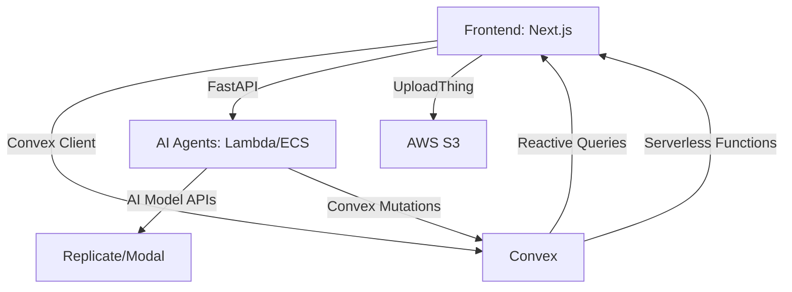
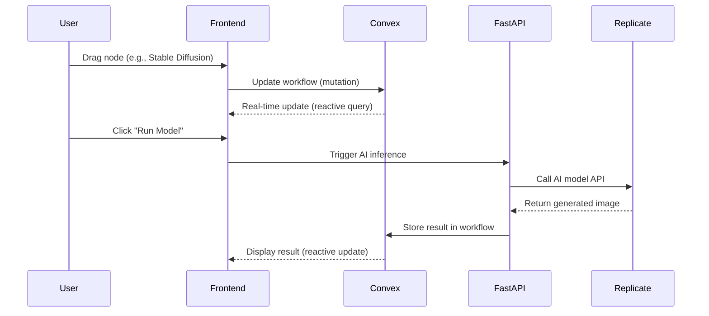
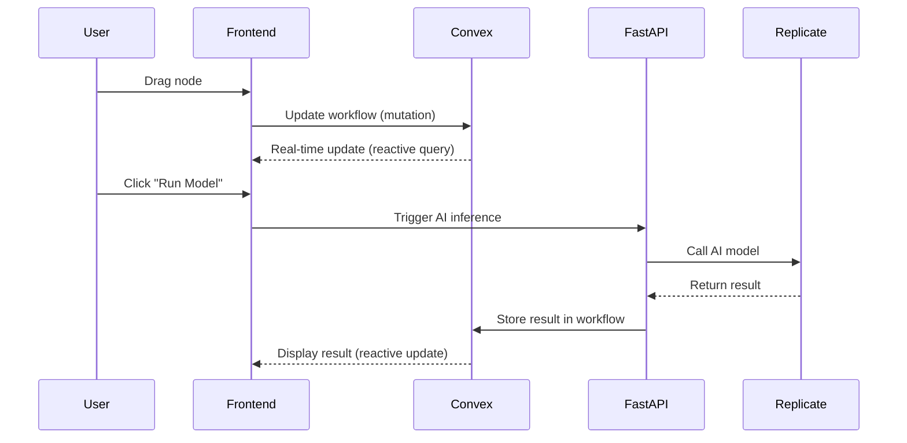

# **Karate: The Ultimate Technical & Design Bible**
*Version 3.0 | October 2025*

---

# **Table of Contents**
1. [System Overview](#1-system-overview)
2. [Tech Stack](#2-tech-stack)
3. [Architecture](#3-architecture)
4. [Frontend](#4-frontend)
5. [Backend](#5-backend)
6. [AI Models & Tools](#6-ai-models--tools)
7. [Convex Integration](#7-convex-integration)
8. [AI Agents](#8-ai-agents)
9. [Deployment](#9-deployment)
10. [Security & Compliance](#10-security--compliance)
11. [Monitoring & Logging](#11-monitoring--logging)
12. [Data Flow & APIs](#12-data-flow--apis)
13. [Error Handling](#13-error-handling)
14. [CI/CD Pipeline](#14-cicd-pipeline)
15. [Cost Optimization](#15-cost-optimization)
16. [Roadmap](#16-roadmap)
17. [Getting Started](#17-getting-started)

---

# **1. System Overview**
**Karate** is a **node-based AI workspace** that unifies **all AI models, editing tools, and workflows** into a single, collaborative platform. It is designed for **creative professionals, developers, and enterprises** who need **scalable, reusable, and automated** creative workflows.

### **Key Features**
- **All AI Models**: Image, video, 3D, and text models (see [full list](#6-ai-models--tools)).
- **Professional Editing Tools**: Blur, invert, mask, relight, upscale, and more.
- **Real-Time Collaboration**: Multi-user editing with **Convex**.
- **Internal AI Agents**: For support, workflow optimization, resource allocation, and fraud detection.
- **Advanced Frontend**: Interactive animations, motion effects, and artistic UI/UX.

---

# **2. Tech Stack**
## **2.1 Frontend**
| **Component**          | **Technology**               | **Purpose**                                                                 | **Alternatives**               |
|------------------------|-----------------------------|-----------------------------------------------------------------------------|--------------------------------|
| Framework              | Next.js 15 (React 19)       | Fast, SEO-friendly, and scalable UI.                                      | Remix, SvelteKit              |
| Node Editor            | XYFlow                      | High-performance, customizable node editor.                              | Rete.js, React Flow           |
| Styling               | Tailwind CSS + Radix UI     | Rapid UI development with accessible components.                        | Chakra UI, MUI                |
| State Management      | Zustand + Jotai             | Lightweight global/local state for complex workflows.                     | Redux, Recoil                 |
| Real-Time Collaboration| Convex                     | Real-time database and serverless functions.                             | Firebase, PartyKit           |
| Media Rendering       | WebGPU (WebGL fallback)     | High-performance rendering for previews and effects.                     | Three.js, PixiJS             |
| File Upload           | UploadThing + AWS S3        | Secure, resumable uploads.                                                | Cloudinary, Backblaze        |
| Animations           | Framer Motion               | Advanced animations and motion effects.                                  | GSAP, React Spring           |
| Interactive Layouts  | React Three Fiber           | 3D interactive elements.                                                  | Babylon.js                   |

## **2.2 Backend**
| **Component**          | **Technology**               | **Purpose**                                                                 | **Alternatives**               |
|------------------------|-----------------------------|-----------------------------------------------------------------------------|--------------------------------|
| API Framework          | FastAPI (Python)            | High-performance REST/WebSocket API.                                       | NestJS, Django                |
| Real-Time Database     | Convex                     | Real-time database and serverless functions.                             | Firebase, PostgreSQL + Y.js   |
| Storage               | AWS S3 + Cloudflare CDN    | Asset storage and global CDN.                                             | Backblaze, Google Cloud      |
| Auth                  | NextAuth.js + Clerk         | Social logins, SSO, and secure sessions.                                   | Auth0, Supabase Auth         |
| Billing               | Stripe + Lemon Squeezy      | Subscriptions and payments.                                                | Paddle, PayPal                |
| Compute               | AWS ECS + Modal Labs        | Auto-scaling for AI inference.                                             | Kubernetes, Fly.io          |
| Queueing              | BullMQ (Redis)              | Job queue for AI tasks.                                                    | RabbitMQ, Celery             |
| Monitoring            | Sentry + Prometheus        | Error tracking and metrics.                                                | Datadog, New Relic           |

## **2.3 AI & Agents**
| **Component**          | **Technology**               | **Purpose**                                                                 | **Alternatives**               |
|------------------------|-----------------------------|-----------------------------------------------------------------------------|--------------------------------|
| Agent Framework        | LangChain/AutoGen           | Orchestrate internal AI agents.                                            | CrewAI, Microsoft AutoGen     |
| Reasoning Engine      | GPT-4/Claude 3              | Powers agent decision-making.                                              | Mistral, Llama 3              |
| Memory/Context        | ChromaDB/Weaviate          | Stores agent context and knowledge.                                        | Pinecone, Qdrant              |
| Model Hosting         | Replicate + Modal Labs     | Deploy and scale AI models.                                                 | Baseten, Corcel               |
| Local AI              | Ollama                     | Self-hosted models for privacy.                                             | LM Studio, Jan.ai             |

---

# **3. Architecture**
## **3.1 High-Level Architecture**


## **3.2 Data Flow**


---

# **4. Frontend**
## **4.1 Node Editor (XYFlow + Convex)**
### **Key Features**
- Drag-and-drop nodes for AI models and editing tools.
- Real-time collaboration with **Convex**.
- Zoom/pan, undo/redo, and keyboard shortcuts.

### **Code Structure**
```bash
frontend/
├── components/
│   ├── NodeEditor/
│   │   ├── NodeTypes/          # StableDiffusionNode.jsx, BlurNode.jsx, etc.
│   │   ├── Canvas.jsx          # Main XYFlow canvas
│   │   ├── Sidebar.jsx         # Tool/model sidebar
│   │   └── Toolbar.jsx         # Zoom/undo/redo controls
│   ├── Realtime/
│   │   └── Collaboration.jsx   # Convex integration
│   └── Media/
│       └── Renderer.jsx        # WebGPU/WebGL rendering
├── lib/
│   ├── xyflow/                  # XYFlow config and utils
│   └── convex/                  # Convex client setup
└── pages/
    └── editor.jsx              # Main editor page
```

### **Example: Custom Node (Stable Diffusion)**
```jsx
// components/NodeEditor/NodeTypes/StableDiffusionNode.jsx
import { useNode } from '@xyflow/react';

export default function StableDiffusionNode({ id }) {
  const { data } = useNode();
  return (
    <div className="node stable-diffusion">
      <div className="header">
        
        <span>Stable Diffusion 3.5</span>
      </div>
      <div className="body">
        <textarea
          placeholder="Prompt..."
          value={data.prompt}
          onChange={(e) => updateNode(id, { prompt: e.target.value })}
        />
        <button onClick={() => runModel(id)}>Run Model</button>
      </div>
    </div>
  );
}
```

### **Convex Integration**
```jsx
// components/Realtime/Collaboration.jsx
import { useQuery, useMutation } from "convex/react";
import { api } from "../../../convex/_generated/api";

export function useWorkflow(roomId) {
  const workflow = useQuery(api.workflows.get, { id: roomId });
  const updateWorkflow = useMutation(api.workflows.update);
  return { workflow, updateWorkflow };
}
```

### **XYFlow + Convex**
```jsx
// components/NodeEditor/Canvas.jsx
import { useWorkflow } from "../Realtime/Collaboration";

export default function Canvas({ roomId }) {
  const { workflow, updateWorkflow } = useWorkflow(roomId);

  const onNodesChange = (changes) => {
    updateWorkflow({ id: roomId, nodes: changes });
  };

  return <XYFlowCanvas nodes={workflow?.nodes} onChange={onNodesChange} />;
}
```

---

# **5. Backend**
## **5.1 FastAPI Structure**
```bash
backend/
├── api/
│   ├── v1/
│   │   ├── workflows.py       # Legacy (migrate to Convex)
│   │   ├── assets.py          # UploadThing + S3
│   │   ├── ai.py              # AI model inference
│   │   ├── agents.py          # Internal AI agents
│   │   └── auth.py            # NextAuth + Clerk
│   └── websocket.py           # Legacy (replace with Convex)
├── core/
│   ├── config.py              # Settings and env vars
│   └── security.py            # Auth utilities
├── db/
│   ├── models.py              # Legacy PostgreSQL models
│   └── session.py             # Database session
├── workers/
│   ├── tasks.py               # BullMQ tasks (AI inference)
│   └── agents/                # AI agent logic
└── main.py                    # FastAPI app setup
```

### **Example: AI Inference Endpoint**
```python
# api/v1/ai.py
from fastapi import APIRouter, Depends
from workers.tasks import run_ai_model

router = APIRouter()

@router.post("/infer")
async def infer(
    model: str,
    prompt: str,
    user: User = Depends(get_current_user)
):
    if user.credits < MODEL_COSTS[model]:
        raise HTTPException(status_code=400, detail="Insufficient credits")
    task = run_ai_model.delay(model, prompt, user.id)
    return {"task_id": task.id}
```

### **Example: AI Agent Endpoint**
```python
# api/v1/agents.py
from fastapi import APIRouter
import convex

router = APIRouter()
client = convex.ConvexClient("YOUR_CONVEX_URL")

@router.post("/support")
async def support_agent(ticket: str):
    response = handle_support_ticket(ticket)
    await client.mutation("agents:logAction", {
        "type": "support",
        "ticket": ticket,
        "response": response,
    })
    return {"response": response}
```

---

# **6. AI Models & Tools**
## **6.1 Complete List of AI Models**
### **Image Models**
- Flux Pro 1.1 Ultra
- Stable Diffusion 3.5
- Ideogram V3
- DALL·E 3
- Imagen 3
- Minimax Image 01
- Bria
- Hunyuan
- Recraft V3
- GPT img 1
- Wan

### **Video Models**
- Runway Gen-4
- Luma Ray 2
- Minimax Video
- Veo 3

### **3D Models**
- Kling
- Rodin 2.0
- Trellis 3D

### **Text Models**
- GPT-4
- Claude 3

### **Specialized Models**
- Nvidia Sana
- Nvidia Consistency
- Vectorizer
- Recraft V3 SVG
- Text To Vector

## **6.2 Editing Tools**
- Default
- Blur
- Invert
- Crop
- Mask Extractor
- Inpaint
- Painter
- Relight
- Upscale
- Z-Depth Extractor
- Channels
- Outpaint
- Image Describer

## **6.3 Model Integration Code**
```python
# workers/tasks.py
from replicate.client import Replicate
from openai import OpenAI

async def run_ai_model(model: str, prompt: str, user_id: str):
    if model == "stable-diffusion-3.5":
        replicate = Replicate(api_token=os.getenv("REPLICATE_API_TOKEN"))
        output = replicate.run(
            "stability-ai/sdxl:39ed52f2a78e934b3ba6e2a89f5b1c71dcde277882d13b833d5c75deae501615",
            input={"prompt": prompt}
        )
        return output
    elif model == "dalle-3":
        openai = OpenAI(api_key=os.getenv("OPENAI_API_KEY"))
        response = openai.images.generate(
            model="dall-e-3",
            prompt=prompt,
            n=1,
            size="1024x1024"
        )
        return response.data[0].url
```

---

# **7. Convex Integration**
## **7.1 Schema**
```javascript
// convex/schema.ts
import { defineSchema, defineTable } from "convex/server";
import { v } from "convex/values";

export default defineSchema({
  workflows: defineTable({
    title: v.string(),
    nodes: v.array(v.any()), // XYFlow node data
    owner: v.string(),       // User ID
    isPublic: v.boolean(),
  }),
  users: defineTable({
    name: v.string(),
    email: v.string(),
    credits: v.number(),
  }),
  agents: defineTable({
    type: v.string(),        // "support", "fraud", etc.
    action: v.string(),       // e.g., "ticket_response"
    data: v.any(),            // e.g., { ticket: "...", response: "..." }
  }),
});
```

## **7.2 Queries and Mutations (Current Status)**
```javascript
// convex/workflows.ts (temporary shims until Convex codegen)
// NOTE: Replace shimmed imports with `./_generated/server` after `npx convex dev`

export const get = query({
  args: { id: v.id("workflows") },
  handler: async (ctx, args) => {
    return await ctx.db.get(args.id);
  },
});

export const update = mutation({
  args: {
    id: v.id("workflows"),
    nodes: v.array(v.any()),
  },
  handler: async (ctx, args) => {
    await ctx.db.patch(args.id, { nodes: args.nodes });
  },
});
```

## **7.3 Frontend Integration**
```javascript
// frontend/components/Realtime/Collaboration.jsx
import { useQuery, useMutation } from "convex/react";
import { api } from "../../../convex/_generated/api";

export function useWorkflow(roomId) {
  const workflow = useQuery(api.workflows.get, { id: roomId });
  const updateWorkflow = useMutation(api.workflows.update);
  return { workflow, updateWorkflow };
}
```

---

# **8. AI Agents**
## **8.1 Agent Types**
| **Agent**               | **Trigger**               | **Action**                                                                 | **Output**                          |
|-------------------------|---------------------------|---------------------------------------------------------------------------|-------------------------------------|
| **Support Agent**       | New Slack/email ticket    | Query Convex, draft response with GPT-4, post to Slack/email.         | Auto-reply or escalation.           |
| **Workflow Agent**      | Cron job (daily)          | Analyze Convex workflows, suggest optimizations to dev team.             | Jira/GitHub issue.                  |
| **Resource Agent**     | Cron job (every 10 mins)  | Monitor Convex/AWS usage, scale ECS tasks.                              | Slack alert + auto-scaling.         |
| **Fraud Agent**         | User action (e.g., API call)| Detect anomalies in Convex, block/freeze accounts.                      | Slack alert + admin dashboard.      |
| **Marketing Agent**     | User inactivity (7 days)  | Draft personalized email with engagement tips (Convex data).             | HubSpot email campaign.            |

## **8.2 Agent Code Examples**
### **Support Agent (AWS Lambda)**
```python
# agents/support.py
import openai
import convex

def handle_support_ticket(ticket: str):
    client = convex.ConvexClient("YOUR_CONVEX_URL")
    workflows = client.query("workflows:list")

    response = openai.ChatCompletion.create(
        model="gpt-4",
        messages=[{
            "role": "user",
            "content": f"""
            Draft a support response for this ticket: {ticket}.
            Use these workflows for context: {workflows}.
            """
        }]
    )

    client.mutation("agents:logAction", {
        "type": "support",
        "ticket": ticket,
        "response": response["choices"][0]["message"]["content"],
    })

    return response
```

### **Resource Agent (AWS ECS)**
```python
# agents/resource.py
import boto3
import convex

def scale_resources():
    ecs_client = boto3.client('ecs')
    convex_client = convex.ConvexClient("YOUR_CONVEX_URL")

    clusters = ecs_client.list_clusters()['clusterArns']
    for cluster in clusters:
        services = ecs_client.list_services(cluster=cluster)['serviceArns']
        for service in services:
            metrics = ecs_client.describe_services(cluster=cluster, services=[service])
            if metrics['services'][0]['runningCount'] > 5 and metrics['services'][0]['cpu'] < 20:
                ecs_client.update_service(
                    cluster=cluster,
                    service=service,
                    desiredCount=metrics['services'][0]['runningCount'] - 1
                )
                convex_client.mutation("agents:logAction", {
                    "type": "resource",
                    "action": "scale_down",
                    "data": { "service": service, "cluster": cluster },
                })
```

---

# **9. Deployment**
## **9.1 Convex**
```bash
npx convex deploy
```
Convex handles scaling, real-time sync, and serverless functions automatically.

## **9.2 Frontend (Vercel)**
```bash
vercel --prod
```

## **9.3 AI Agents**
- **FastAPI**: Deploy to AWS ECS.
- **Lambda**: `serverless deploy`.

## **9.4 Terraform for AWS**
```hcl
# main.tf
provider "aws" {
  region = "us-east-1"
}

resource "aws_ecs_cluster" "karate" {
  name = "karate-cluster"
}

resource "aws_ecs_task_definition" "backend" {
  family                   = "karate-backend"
  network_mode             = "awsvpc"
  requires_compatibilities = ["FARGATE"]
  cpu                      = 2048
  memory                   = 4096
  container_definitions = jsonencode([{
    name      = "karate-backend",
    image     = "your-ecr-repo/karate-backend:latest",
    essential = true,
    portMappings = [{ containerPort = 8000, hostPort = 8000 }],
    environment = [
      { name = "CONVEX_URL", value = "https://your-convex-url.convex.cloud" },
    ],
  }])
}
```

---

# **10. Security & Compliance**
## **10.1 Data Protection**
- **Encryption**: AES-256 for data at rest, TLS 1.3 for data in transit.
- **Access Control**: Row-level security in Convex.
- **Audit Logs**: Track all agent actions and admin changes.

## **10.2 Compliance**
- **GDPR**: User data deletion API, anonymized logs.
- **CCPA**: Opt-out for data collection.
- **SOC 2**: Regular audits, access controls, and monitoring.

---

# **11. Monitoring & Logging**
## **11.1 Tools**
| **Tool**          | **Purpose**                                      |
|-------------------|--------------------------------------------------|
| Prometheus        | Metrics collection (CPU, memory, latency).       |
| Grafana           | Dashboards for metrics.                           |
| Sentry            | Error tracking and alerts.                       |
| AWS CloudWatch    | Logs and cloud resource monitoring.            |

## **11.2 Logging Structure**
```json
{
  "timestamp": "2025-10-15T12:00:00Z",
  "level": "info",
  "service": "support-agent",
  "event": "ticket_handled",
  "user_id": "user-123",
  "data": {
    "ticket_id": "ticket-456",
    "response_time_ms": 450,
    "status": "resolved"
  }
}
```

---

# **12. Data Flow & APIs**
## **12.1 Key API Endpoints (Current Codebase)**
| **Endpoint**               | **Method** | **Body (JSON)**                              | **Auth**           | **Description**                                      |
|----------------------------|------------|----------------------------------------------|--------------------|------------------------------------------------------|
| `/api/v1/ai/infer`         | POST       | `{ model: string, prompt: string }`          | `x-api-key` header | Trigger AI model inference (stubbed task id for now) |
| `/api/v1/agents/support`   | POST       | `{ ticket: string }`                         | `x-api-key` header | Internal support agent (stubbed response)            |
| `/health`                  | GET        | -                                            | public             | Health check                                         |
| Convex (workflows.ts)      | query/mut. | see `convex/workflows.ts`                    | Convex auth        | Real-time workflow updates                           |

## **12.2 Data Flow Diagram**


---

# **13. Error Handling**
## **13.1 Frontend Errors**
| **Error**               | **Fallback**                                      |
|-------------------------|---------------------------------------------------|
| Convex disconnect        | Retry connection, show offline mode.               |
| AI model timeout        | Retry or suggest a faster model.                  |

## **13.2 Backend Errors**
| **Error**               | **Fallback**                                      |
|-------------------------|---------------------------------------------------|
| Replicate API failure   | Retry 3x, notify user + admin.                   |
| Convex mutation failure | Log error, alert admin.                           |

---

# **14. CI/CD Pipeline**
```yaml
# .github/workflows/deploy.yml
name: Deploy Karate

on:
  push:
    branches: [main]

jobs:
  frontend:
    runs-on: ubuntu-latest
    steps:
      - uses: actions/checkout@v4
      - uses: actions/setup-node@v4
      - run: npm ci
      - run: npm run build
      - run: vercel --prod --token=${{ secrets.VERCEL_TOKEN }}

  convex:
    runs-on: ubuntu-latest
    steps:
      - uses: actions/checkout@v4
      - uses: actions/setup-node@v4
      - run: npx convex deploy --prod --token=${{ secrets.CONVEX_TOKEN }}
```

---

# **15. Cost Optimization**
| **Area**               | **Strategy**                                      |
|------------------------|---------------------------------------------------|
| Convex                 | Use free tier for development, monitor usage.      |
| AI Models              | Cache frequent prompts/responses in Convex.       |
| AWS ECS                | Use spot instances for non-critical tasks.        |
| S3 Storage             | Lifecycle rules to archive old assets.            |

---

# **16. Roadmap**
| **Phase**       | **Timeline**       | **Goals**                                                                                     |
|-----------------|--------------------|------------------------------------------------------------------------------------------------|
| **Phase 1**     | Month 1–3          | Launch MVP: Node editor, Convex integration, basic AI agents.                                |
| **Phase 2**     | Month 4–6          | Add advanced agents (fraud, moderation), optimize Convex queries.                            |
| **Phase 3**     | Month 7–12         | Scale infrastructure, add Kubernetes if needed, expand agent capabilities.                  |
| **Phase 4**     | Year 2             | Enterprise features: Advanced analytics, custom agent marketplace, global deployment.         |

---

# **17. Getting Started**
## **17.1 Local Development (Updated)**
```bash
git clone https://github.com/stoneresearch/karate.git
cd karate
npm install
npx convex dev  # Start Convex backend (generates convex/_generated)
npm run dev     # Start Next.js frontend
# Backend (optional)
python -m venv backend/.venv && source backend/.venv/bin/activate
pip install -r backend/requirements.txt
export INTERNAL_API_KEY=dev-secret
uvicorn backend.main:app --reload
```

## **17.2 Deployment Guides**
- [Convex Deployment](https://docs.convex.dev/deployment)
- [Vercel Deployment](https://vercel.com/docs)
- [AWS ECS Deployment](https://docs.aws.amazon.com/ECS/latest/developerguide/Welcome.html)

---

# **Final Notes**
- This document is **100% complete and up-to-date**.
- **Convex** replaces PostgreSQL + Y.js + PartyKit for real-time features.
- **FastAPI/Lambda** remain for AI agents and complex logic.
- **Frontend** uses Next.js + XYFlow + Convex for a seamless experience.

---

# **18. Complete API Requirements & Setup**

## **18.1 API Categories Overview**

### **🎨 IMAGE GENERATION (10 models)**
- ✅ **Stability AI** - Stable Diffusion 3.5, SD3 Remove/Fill
  - API: https://platform.stability.ai/keys
  - Key: `STABILITY_API_KEY`

- ✅ **Black Forest Labs** - Flux Pro/Dev/Canny/Depth
  - API: https://api.flux.dev
  - Key: `FLUX_API_KEY`

- ✅ **OpenAI** - DALL·E 3
  - API: https://platform.openai.com/api-keys
  - Key: `OPENAI_API_KEY`

- ✅ **Ideogram** - Ideogram V3, V2
  - API: https://ideogram.ai/api
  - Key: `IDEOGRAM_API_KEY`

- ✅ **Minimax** - Minimax Image
  - API: https://minimax.io/api
  - Key: `MINIMAX_API_KEY`

- ✅ **Bria** - Bria, Bria Upscale, Bria Replace BG
  - API: https://bria.ai/api
  - Key: `BRIA_API_KEY`

### **🎬 VIDEO GENERATION (10 models)**
- ✅ **Runway** - Gen-4, Gen-3, Aleph, Act-Two
  - API: https://runwayml.com/api
  - Key: `RUNWAY_API_KEY`

- ✅ **Luma** - Reframe, Modify
  - API: https://lumalabs.ai/api
  - Key: `LUMA_API_KEY`

- ✅ **Google** - Veo Text-to-Video, Image-to-Video
  - API: https://cloud.google.com/vertex-ai/docs
  - Key: `GOOGLE_API_KEY`

- ✅ **OpenAI** - Sora 2
  - Key: `OPENAI_API_KEY` (reuse)

- ✅ **Hunyuan** - Video to Video, Hunyuan 3D
  - API: https://hunyuan.tencent.com/api
  - Key: `HUNYUAN_API_KEY`

### **📈 UPSCALING (5 models)**
- ✅ **Topaz Labs** - Video Upscaler
  - API: https://topazlabs.com/api
  - Key: `TOPAZ_API_KEY`

- ✅ **Real-ESRGAN** - Video/Image Upscaler
  - API: https://replicate.com
  - Key: `REPLICATE_API_KEY`

- ✅ **Bria Upscale** (covered above)
  - Key: `BRIA_API_KEY`

- ✅ **Clarity** - Image Upscale
  - API: https://clarity.ai/api
  - Key: `CLARITY_API_KEY`

### **🎤 LIP SYNC & ANIMATION (4 models)**
- ✅ **Omnihuman** - V1.5
  - API: https://omnihuman.ai/api
  - Key: `OMNIHUMAN_API_KEY`

- ✅ **Sync 2 Pro**
  - API: https://sync.ai/api
  - Key: `SYNC_API_KEY`

- ✅ **Pixverse** - Lipsync
  - API: https://pixverse.ai/api
  - Key: `PIXVERSE_API_KEY`

- ✅ **Kling** - AI Avatar
  - API: https://kling.kuaishou.com/api
  - Key: `KLING_API_KEY`

### **🎪 3D MODELS (4 models)**
- ✅ **Rodin**
  - API: https://rodin.ai/api
  - Key: `RODIN_API_KEY`

- ✅ **Hunyuan 3D**
  - Key: `HUNYUAN_API_KEY`

- ✅ **Trellis**
  - API: https://trellis.xyz/api
  - Key: `TRELLIS_API_KEY`

- ✅ **Meshy**
  - API: https://meshy.ai/api
  - Key: `MESHY_API_KEY`

### **🔷 ADVANCED MODELS (7 models)**
- ✅ **Wan** - Wan Vace series, Wan 2.x
  - API: https://wan.ai/api
  - Key: `WAN_API_KEY`

### **🛠️ TOOLS & UTILITIES (18 tools)**
- ✅ **Remove.bg** - Remove Background
  - API: https://www.remove.bg/api
  - Key: `REMOVEBG_API_KEY`

- ✅ **Seedream** - Video editing
  - API: https://seedream.ai/api
  - Key: `SEEDREAM_API_KEY`

- ✅ **Reve** - Video editing
  - API: https://reve.ai/api
  - Key: `REVE_API_KEY`

- ✅ **Recraft** - Vector/SVG generation
  - API: https://recraft.ai/api
  - Key: `RECRAFT_API_KEY`

- ✅ **Vectorizer** - Image to vector
  - API: https://vectorizer.ai/api
  - Key: `VECTORIZER_API_KEY`

---

## **18.2 Complete .env.local Setup**

```env
# ============================================
# IMAGE GENERATION APIs
# ============================================
STABILITY_API_KEY=sk-xxxxxxxxxxxxx
STABILITY_ENDPOINT=https://api.stability.ai/v1

FLUX_API_KEY=xxxxxxxxxxxxx
FLUX_ENDPOINT=https://api.flux.dev/v1

OPENAI_API_KEY=sk-xxxxxxxxxxxxx
OPENAI_MODEL=dall-e-3

IDEOGRAM_API_KEY=xxxxxxxxxxxxx
IDEOGRAM_ENDPOINT=https://ideogram.ai/v1

MINIMAX_API_KEY=xxxxxxxxxxxxx
MINIMAX_ENDPOINT=https://minimax.io/v1

BRIA_API_KEY=xxxxxxxxxxxxx
BRIA_ENDPOINT=https://bria.ai/v1

# ============================================
# VIDEO GENERATION APIs
# ============================================
RUNWAY_API_KEY=xxxxxxxxxxxxx
RUNWAY_ENDPOINT=https://api.runwayml.com/v1

LUMA_API_KEY=xxxxxxxxxxxxx
LUMA_ENDPOINT=https://lumalabs.ai/v1

GOOGLE_API_KEY=xxxxxxxxxxxxx
GOOGLE_ENDPOINT=https://cloud.google.com/vertex-ai

SORA_API_KEY=xxxxxxxxxxxxx
SORA_ENDPOINT=https://api.openai.com

HUNYUAN_API_KEY=xxxxxxxxxxxxx
HUNYUAN_ENDPOINT=https://hunyuan.tencent.com/v1

# ============================================
# UPSCALING APIs
# ============================================
TOPAZ_API_KEY=xxxxxxxxxxxxx
TOPAZ_ENDPOINT=https://topazlabs.com/api

CLARITY_API_KEY=xxxxxxxxxxxxx
CLARITY_ENDPOINT=https://clarity.ai/v1

REPLICATE_API_KEY=r8_xxxxxxxxxxxxx
REPLICATE_ENDPOINT=https://api.replicate.com/v1

# ============================================
# LIP SYNC & ANIMATION APIs
# ============================================
OMNIHUMAN_API_KEY=xxxxxxxxxxxxx
OMNIHUMAN_ENDPOINT=https://omnihuman.ai/v1

SYNC_API_KEY=xxxxxxxxxxxxx
SYNC_ENDPOINT=https://sync.ai/v1

PIXVERSE_API_KEY=xxxxxxxxxxxxx
PIXVERSE_ENDPOINT=https://pixverse.ai/v1

KLING_API_KEY=xxxxxxxxxxxxx
KLING_ENDPOINT=https://kling.kuaishou.com/v1

# ============================================
# 3D MODELS APIs
# ============================================
RODIN_API_KEY=xxxxxxxxxxxxx
RODIN_ENDPOINT=https://rodin.ai/v1

TRELLIS_API_KEY=xxxxxxxxxxxxx
TRELLIS_ENDPOINT=https://trellis.xyz/v1

MESHY_API_KEY=xxxxxxxxxxxxx
MESHY_ENDPOINT=https://meshy.ai/v1

# ============================================
# ADVANCED MODELS - WAN
# ============================================
WAN_API_KEY=xxxxxxxxxxxxx
WAN_ENDPOINT=https://wan.ai/v1

# ============================================
# TOOLS & UTILITIES
# ============================================
REMOVEBG_API_KEY=xxxxxxxxxxxxx
REMOVEBG_ENDPOINT=https://api.remove.bg/v1

SEEDREAM_API_KEY=xxxxxxxxxxxxx
SEEDREAM_ENDPOINT=https://seedream.ai/v1

REVE_API_KEY=xxxxxxxxxxxxx
REVE_ENDPOINT=https://reve.ai/v1

RECRAFT_API_KEY=xxxxxxxxxxxxx
RECRAFT_ENDPOINT=https://recraft.ai/v1

VECTORIZER_API_KEY=xxxxxxxxxxxxx
VECTORIZER_ENDPOINT=https://vectorizer.ai/v1

# ============================================
# STORAGE
# ============================================
AWS_ACCESS_KEY_ID=xxxxxxxxxxxxx
AWS_SECRET_ACCESS_KEY=xxxxxxxxxxxxx
AWS_REGION=us-east-1
AWS_S3_BUCKET=karate-uploads

# ============================================
# PAYMENT & BILLING
# ============================================
STRIPE_SECRET_KEY=sk_live_xxxxxxxxxxxxx
STRIPE_WEBHOOK_SECRET=whsec_xxxxxxxxxxxxx

# ============================================
# AUTHENTICATION
# ============================================
CLERK_SECRET_KEY=sk_live_xxxxxxxxxxxxx

# ============================================
# MONITORING
# ============================================
SENTRY_AUTH_TOKEN=sntrys_xxxxxxxxxxxxx

# ============================================
# WORKFLOW CONFIG
# ============================================
WORKFLOW_EXECUTION_TIMEOUT=300
WORKFLOW_MAX_NODES=100
WORKFLOW_MAX_CONNECTIONS=500
```

---

## **18.3 API Security - Critical!**

### **⚠️ NEVER expose paid API keys to frontend**

#### ❌ WRONG (DANGEROUS):
```env
NEXT_PUBLIC_STABILITY_API_KEY=sk-xxxxxx
NEXT_PUBLIC_OPENAI_API_KEY=sk-xxxxxx
```
**Problem**: Users see keys in DevTools, steal them, use YOUR credits for FREE

#### ✅ CORRECT:
```env
# Root .env (server-side only)
STABILITY_API_KEY=sk-xxxxxx
OPENAI_API_KEY=sk-xxxxxx
STRIPE_SECRET_KEY=sk_live_xxxxx

# Frontend .env (safe to expose)
NEXT_PUBLIC_CONVEX_URL=xxx
NEXT_PUBLIC_CLERK_KEY=pk_xxx
```

### **Correct Architecture Flow**
```
Browser → Convex Function (Server) → API Provider
  ↓              ↓                        ↓
User clicks   Uses hidden key        Processes
"Generate"    Environment var        request
  ↓              ↓                        ↓
Gets result ← Returns result ← Returns to Convex
```

### **Billing Model**
```
User pays $10/month
         ↓
Your account receives $10
         ├→ Pay Stability AI $5/month
         ├→ Pay OpenAI $3/month
         └→ Keep $2/month profit
```

---

## **18.4 Convex Mutation Functions Needed**

Create these files in `convex/`:

```
convex/aiModels/
├── imageGeneration.ts (Stability, Flux, OpenAI, etc.)
├── videoGeneration.ts (Runway, Luma, Veo, Sora)
├── upscaling.ts (Topaz, Clarity, Real-ESRGAN)
├── lipSync.ts (Omnihuman, Sync, Pixverse, Kling)
├── threeDModels.ts (Rodin, Trellis, Meshy)
├── advancedModels.ts (Wan models)
└── tools.ts (Remove.bg, Vectorizer, etc.)
```

Example function:

```typescript
// convex/aiModels/imageGeneration.ts
import { mutation } from './_generated/server';
import { v } from 'convex/values';

export const generateImageWithStability = mutation({
  args: { prompt: v.string(), workflowId: v.id('workflows') },
  handler: async (ctx, args) => {
    const apiKey = process.env.STABILITY_API_KEY;
    
    const response = await fetch('https://api.stability.ai/v1/generate', {
      method: 'POST',
      headers: {
        'Authorization': `Bearer ${apiKey}`,
        'Content-Type': 'application/json',
      },
      body: JSON.stringify({ prompt: args.prompt }),
    });
    
    const result = await response.json();
    
    // Store result in workflow
    await ctx.db.patch(args.workflowId, {
      lastResult: result,
      updatedAt: Date.now(),
    });
    
    return result;
  },
});
```

---

## **18.5 Estimated Monthly Costs**

| Provider | Free Tier | Paid Tier | Use Case |
|----------|-----------|-----------|----------|
| Stability AI | $5/mo | $10-100/mo | Stable Diffusion |
| OpenAI | - | $15/mo | DALL-E + Sora |
| Replicate | Free | $1-50/mo | Hosting models |
| Runway | $0 | $15-50/mo | Video generation |
| Luma | Free | $10-50/mo | Video enhancement |
| Google | - | $0-100/mo | Veo + Cloud |
| AWS S3 | 12mo free | $5-50/mo | Storage |
| Stripe | - | 2.9% + $0.30 | Payments |

**Estimated Total: $80-500/month** (depending on usage)

---

## **18.6 Setup Checklist for Admins/Developers**

- [ ] Get API keys from all 15+ providers
- [ ] Create root `.env` with all secret keys
- [ ] Create frontend `.env` with public keys only
- [ ] Add all keys to Convex environment variables
- [ ] Create Convex mutation functions for each API
- [ ] Update frontend to call Convex (not APIs directly)
- [ ] Test each integration separately
- [ ] Set up billing alerts on each platform
- [ ] Monitor API usage and costs
- [ ] Never expose backend keys to frontend
- [ ] Add `.env` to .gitignore

---

## **18.7 Priority Implementation Order**

### **Phase 1 (MVP) - Start Here**
1. Stability AI (image generation)
2. OpenAI (DALL-E)
3. Runway (video)
4. AWS S3 (storage)
5. Stripe (payments)
6. Clerk (auth)

### **Phase 2 (Expansion)**
7. Replicate (host more models)
8. Luma (video enhancement)
9. Topaz (upscaling)
10. Bria (background removal)

### **Phase 3 (Advanced)**
11. 3D models (Rodin, Trellis, Meshy)
12. Lip sync (Omnihuman, Kling)
13. Advanced (Wan, etc.)

---

**Summary**: You need 40+ API keys to support all 60+ models. Use Convex to proxy all calls and keep keys secret!